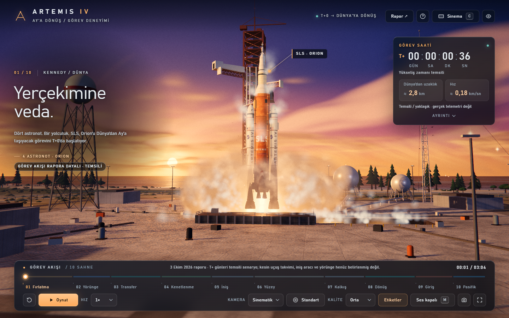

# ARTEMIS IV · T+0

3 Ekim 2026 Artemis IV araştırma raporuna göre hazırlanmış, tarayıcıda çalışan sinematik 3D görev deneyimi.

**Canlı demo:** https://pandakingpunc.github.io/artemis-iv-3d/

## Açma

En kolayı yukarıdaki canlı demo bağlantısıdır. Yerelde çalıştırmak için:

`BASLAT.cmd` dosyasını çift tıklayın. Node.js gereklidir; paket kurulumu ve internet bağlantısı gerekmez. Alternatif: `node server.cjs`, ardından http://127.0.0.1:5184/ adresini açın. ES modülleri nedeniyle index.html doğrudan çift tıklanarak açılmaz. Açılan küçük sunucu penceresini kapatınca sunucu durur.

İlk açılışta ekran kartı gölgelendiricileri derlenir: yükleme ekranı birkaç saniye (ilk seferde ~15–20 sn, sonraki açılışlarda belirgin biçimde daha kısa) sürebilir. Bu sırada bütün sahneler bir kez hazırlanır; böylece film sırasında sahne geçişlerinde takılma olmaz. Yükleme bitince "Görevi başlat" ekranı gelir; buradan sesli veya sessiz başlatabilirsiniz.

## Kontroller

| Tuş / düğme | İşlev |
|---|---|
| Space | Oynat / duraklat |
| ← → | 2 saniye geri / ileri |
| 1 … 9, 0 | Sahneye git (0 = 10. sahne) |
| C | Sinema modu (2.39:1 siyah bantlar, arayüz gizli; Esc ile çık) |
| H | Arayüzü gizle / göster |
| F | Tam ekran |
| M | Ses aç / kapat |
| L | Sahne etiketleri |
| ? | Kısayollar penceresi |
| Shift + D | Performans göstergesi (FPS, kalite kademesi) |

Zaman çizelgesi sürüklenebilir; üzerine gelince sahne adı ve süre görünür. Hız 0.1×–4×. Kamera: Sinematik veya Serbest (sol sürükle döndür, tekerlek yaklaş, sağ sürükle kaydır). Kamera planı: standart / uzak (geniş açı) / yakın. Kalite: düşük / orta / yüksek. Sahne PNG kaydı. Rapor düğmesi kaynakları ve temsilî ayrıntıları gösterir.

## Görsel ve işitsel özellikler

- **Görüntü hattı:** HDR sahne, 4× MSAA, fiziksel tabanlı bloom, ACES/AgX ton eşleme, sahneye özel renk derecelendirmesi, vinyet, film greni; her dünya için ortam (yansıma) haritası.
- **Fırlatma:** LC-39B şafak sahnesi; ayrıntılı SLS Block 1 (4 RS-25, 5 segmentli SRB'ler, LVSA, ICPS, kaçış kulesi), hareketli göbek kolları, su püskürtme, yıldırım direkleri, VAB, kıyı ve sörf; dolgun egzoz dumanı, şok elmaslı alevler, booster ayrılması.
- **Uzay:** gece tarafı şehir ışıkları, prosedürel bulutlar, Güneş'e duyarlı atmosfer ve okyanus parıltısı olan Dünya; fotometrik Ay; renkli yıldız alanı, Samanyolu ve Güneş.
- **Araçlar:** ayrıntılı Orion (ısı kalkanı, kenetlenme halkası, X açılı güneş panelleri), genel temsilî HLS iniş aracı (altın MLI folyo, açılan iniş bacakları, merdiven), eklemli EVA giysili astronotlar, DUSTER ve SPSS aday yükleri, turuncu/beyaz ana paraşütler, gerçek ölçekli kurtarma gemisi ve botlar.
- **Koreografi:** RCS itki püskürmeleri ve temas anı olan kenetlenme; Ay'a iniş (toz tabakası, bacak sönümlemesi); astronotların merdivenden inip bayrak, SPSS ve DUSTER'ı kurması; Ay'dan kalkış ve yörüngede birleşme; servis modülü ayrılması, plazma kılıfı ve iz; paraşütlerin açılması, sıçrama, kurtarma.
- **Ses:** tamamen prosedürel (dosya yok): sahneye göre değişen ambiyans müziği, fırlatma gürlemesi ve SRB çıtırtısı, Quindar telsiz tonları, kenetlenme mandalı, iniş, plazma uğultusu, okyanus. Ses, kullanıcı açınca başlar.

## Raporla ilişki

T+0 mürettebatlı fırlatmadır. 10 sahne, 184 saniyelik izleme süresinde yaklaşık 20 günlük örnek akışı canlandırır. Görev saati her sahnede farklı oranda ilerler. 18–21 gün dönüş aralığından 20. gün seçilmiştir; bu görsel anlatı tercihidir. NASA'nın kesin T+ uçuş takvimi değildir. Telemetri panelindeki uzaklık/hız değerleri temsilî ve yaklaşıktır; gerçek telemetri değildir.

Görev sırası rapordan alınmıştır: SLS/Orion fırlatma, araç kontrolleri, Ay'a transfer, ticari HLS ile kenetlenme, iki kişinin güney kutup bölgesine inişi, bilim, kalkış ve ekip birleşmesi, Dünya'ya transfer, atmosfer girişi, Pasifik'e iniş/kurtarma. Gateway durağı eklenmez. HLS genel temsilî modeldir; sağlayıcı seçilmez. DUSTER ve SPSS kesin uçuş yükü olarak sunulmaz. İniş sahası, rota, yörünge, roket ayrılma zamanları, yüzey faaliyetleri, araç boyutları ve kameralar görsel anlatım için temsilîdir. Bu, uçuş dinamiği veya mühendislik doğrulama simülatörü değildir.

Kaynak rapor: `rapor.md`. Three.js 0.180.0 MIT lisansı: `vendor/LICENSE-three.txt`. Dünya ve Ay doku dosyaları: Three.js resmî örnek deposu, https://threejs.org/examples/textures/planets/ (earth_atmos_2048.jpg, earth_normal_2048.jpg, earth_specular_2048.jpg, moon_1024.jpg). Diğer bütün dokular, modeller ve sesler kod içinde prosedürel üretilir.

## Kod yapısı

| Dosya | Görev |
|---|---|
| `app.js` | Sahne listesi, dünyaların kurulumu, koreografi, kameralar, kare döngüsü, kalite kademeleri |
| `src/timeline.js` | Ortak olay zamanları (kenetlenme, iniş, paraşüt, sıçrama…) ve astronot yürüyüş rotaları |
| `src/post.js`, `src/looks.js` | HDR görüntü hattı; sahneye özel ışık, sis, ortam haritası ve renk |
| `src/space.js` | Yıldızlar, Samanyolu, Güneş, Dünya, Ay |
| `src/launchpad.js` | Fırlatma kompleksi ve SLS/Orion |
| `src/spacecraft.js` | Orion, HLS, astronotlar, yükler, kapsül, paraşütler, gemi ve botlar |
| `src/effects.js` | Alevler, duman, toz, plazma, RCS, sıçrama ve köpük |
| `src/terrain.js`, `src/ocean.js`, `src/sky.js` | Ay arazisi, Pasifik okyanusu, şafak gökyüzü |
| `src/ui.js`, `src/boot.js`, `index.html`, `style.css` | Arayüz, yükleme ekranı, kısayollar |
| `src/audio.js` | Prosedürel ses |

## Performans

Orta kalite varsayılandır. Kare hızı ekran yenileme hızına göre eşit aralıklı seçilir (60 Hz ekranda 60, 144 Hz ekranda 72 FPS). Uyarlanabilir kalite yalnızca oynatma sırasında süreklilik gösteren yavaşlıkta kademeyi düşürür, ortam sakinleşince geri yükseltir; sahne atlama ve geçişlerindeki anlık takılmaları dikkate almaz. Arka plandaki sekmede çizim ve ses durur. Bütün animasyonlar mutlak film zamanından ve sabit tohumlardan hesaplanır: aynı ana geri sarınca aynı sahne oluşur (ekran kartı sürücüsünden kaynaklı en fazla 1/255 piksel farkı dışında); yeniden oynatma yeni geometri veya ses düğümü biriktirmez.

## Lisans

Kod MIT lisansı ile yayımlanmıştır (`LICENSE`). Three.js MIT lisansı: `vendor/LICENSE-three.txt`.
